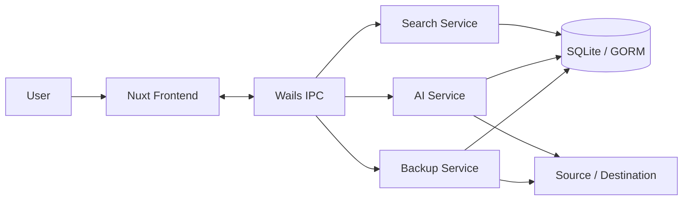

# Final Project: Photo Transfer and AI Analysis

> [!summary] Project Summary
> แอป Desktop ด้วย Wails + Go + Nuxt สำหรับย้ายรูปจาก Flash Drive หรือโฟลเดอร์โทรศัพท์ไปยัง Destination จากนั้นใช้ AI สร้างคำอธิบายและ Tags เพื่อค้นหารูปและแสดง Tag Cloud

## Project Navigation

### 01 — Cross Platform App

- [[01-Requirements and Flow]]
- [[02-Team Division]]
- [[03-Milestones]]

### 02 — Back end (Go)

- [[02-Back end (Go)/00-Backend Architecture|Backend Architecture]]
- [[02-Back end (Go)/01-Backup Engine|Backup Engine]]
- [[02-Back end (Go)/02-Database and GORM|Database and GORM]]
- [[02-Back end (Go)/03-AI and Search|AI and Search]]

### 03 — Front End

- [[03-Front End/00-Frontend Overview|Frontend Overview]]
- [[03-Front End/01-Screens and UX|Screens and UX]]

### 04 — Wails-Nuxt-IPC

- [[04-Wails-Nuxt-IPC/00-IPC Contract|IPC Contract]]
- [[04-Wails-Nuxt-IPC/01-Events and Progress|Events and Progress]]

### 05 — Wails Application

- [[05-Wails Application/00-Git Workflow|Git Workflow]]
- [[05-Wails Application/01-Testing Checklist|Testing Checklist]]
- [[05-Wails Application/02-Demo Plan|Demo Plan]]
- [[05-Wails Application/03-Build and Security|Build and Security]]

## Current Scope

- [ ] เลือก Source และ Destination
- [ ] Scan เฉพาะรูป JPG/JPEG, PNG และ WebP
- [ ] เลือกรูปบางส่วนหรือ Select All
- [ ] ย้ายไฟล์แบบ Cut/Paste อย่างปลอดภัย
- [ ] บันทึกข้อมูลด้วย SQLite และ GORM
- [ ] แสดง Gallery จาก Destination
- [ ] วิเคราะห์ Description และ Tags ด้วย AI
- [ ] ค้นจาก Description และ Tags
- [ ] แสดง Tag Cloud
- [ ] ตรวจ Integrity ระหว่าง Database กับไฟล์จริง
- [ ] ทำงานบน Windows และ macOS

## System Overview



## Definition of Success

โปรเจกต์พร้อมส่งเมื่อผู้ใช้สามารถทำ Flow นี้ได้โดยไม่ใช้ Terminal:

```text
เลือก Source/Destination
→ Scan และเลือกรูป
→ Move
→ ดู Gallery
→ Analyze
→ Search/Tag Cloud
```

และต้องไม่มีกรณีลบไฟล์ต้นฉบับเมื่อ Copy หรือการตรวจสอบปลายทางล้มเหลว
