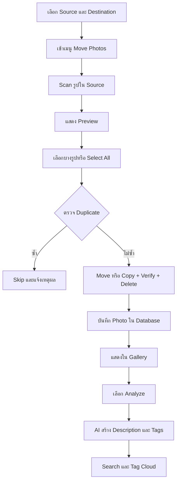

# Requirements and Flow

กลับไปที่ [[00-Project Home]]

## ขอบเขต

ระบบย้ายเฉพาะรูปที่รองรับ ไม่ย้าย PDF, ZIP, เอกสาร หรือไฟล์ประเภทอื่น

### รูปแบบไฟล์ MVP

- JPG/JPEG
- PNG
- WebP

HEIC, GIF, BMP และ TIFF เป็น Feature เพิ่มภายหลัง

## User Flow

## Feature Requirements

### Setup

- เลือก Source และ Destination ด้วย Native Directory Dialog
- ตรวจว่า Path มีอยู่จริงและอ่าน/เขียนได้
- จำค่าล่าสุดใน `settings`
- ป้องกันการกด Scan หรือ Move เมื่อยังตั้งค่าไม่ครบ

### Scan และ Selection

- Scan รูปใน Source
- ตรวจทั้ง Extension และเนื้อหาไฟล์
- แสดง Thumbnail, Filename และขนาด
- เลือกทีละรูป, Select All และ Clear Selection
- มีปุ่ม Refresh

### Move

- ย้ายเหมือน Cut/Paste
- ตรวจชื่อซ้ำใน Destination และ Database
- แสดง Progress และเวลารวม
- Error หนึ่งรูปต้องไม่หยุดทั้งชุด
- หลังย้ายสำเร็จให้ Refresh Gallery อัตโนมัติ

### Gallery และ Integrity

- Gallery ใช้ Database เป็นรายการหลักและตรวจไฟล์จริงบน Disk
- Record มีแต่ไฟล์หาย ให้แสดง `missing`
- ลบผ่านแอป ให้ลบไฟล์จริง พร้อมลบ Record ใน `photos` และ `photo_tags`
- ไฟล์กลับมา ให้เปลี่ยนเป็น `active`

### AI

- วิเคราะห์ได้ทั้งหนึ่งรูปและหลายรูป
- สถานะ `pending`, `processing`, `completed`, `failed`
- บันทึก Description และ Tags
- Retry ได้
- AI ล้มเหลวต้องไม่กระทบไฟล์ที่ย้ายสำเร็จ

### Search

- ค้น Description แบบข้อความบางส่วน
- ค้นจากหนึ่งหรือหลาย Tags
- ค้น Description + Tags พร้อมกัน
- Tag Cloud แสดงขนาดตามจำนวนรูป

## Out of Scope สำหรับ MVP

- รองรับ MTP ของ Android/iPhone โดยตรง
- Sync Cloud Storage
- Face Recognition
- Video Analysis
- HEIC Conversion
- การแก้ไขรูปภาพ

โทรศัพท์ใน MVP ต้องมองเห็นเป็นโฟลเดอร์หรือเลือกโฟลเดอร์ DCIM ที่ระบบเข้าถึงได้
