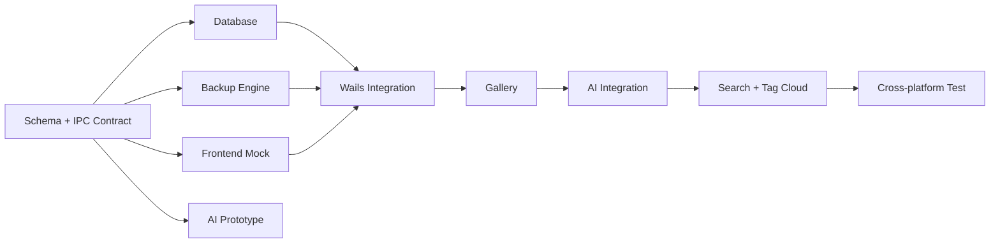

# Milestones

กลับไปที่ [[00-Project Home]]

## Milestone 0 — Team Contract

- [ ] ยืนยัน User Flow
- [ ] ยืนยัน Database 4 ตาราง
- [ ] ยืนยันชนิดรูปที่รองรับ
- [ ] ยืนยัน [[04-Wails-Nuxt-IPC/00-IPC Contract|IPC Contract]]
- [ ] เลือก AI Provider
- [ ] เตรียมรูปทดสอบชุดเดียวกัน

## Milestone 1 — Parallel Foundation

- สมาชิก 1: Models, SQLite และ GORM
- สมาชิก 2: Scan/Move Engine ด้วย Temporary Directory
- สมาชิก 3: UI ด้วย Mock Data
- สมาชิก 4: AI Prototype และ Search Query Design

## Milestone 2 — Backup MVP

- [ ] Select Source/Destination
- [ ] Scan และเลือกภาพ
- [ ] Move Selected/All
- [ ] Duplicate Protection
- [ ] Database Records
- [ ] Progress และเวลา
- [ ] Integrity Check

> [!important]
> Backup MVP ต้องเสร็จก่อนเพิ่ม AI ขั้นสูง เพราะเป็นฐานข้อมูลและไฟล์สำหรับทุก Feature หลังจากนี้

## Milestone 3 — Gallery และ AI

- [ ] Gallery จาก Database + Disk
- [ ] Analyze Selected
- [ ] Description และ Tags
- [ ] Analysis Status
- [ ] Retry

## Milestone 4 — Search

- [ ] Description Search
- [ ] Tag Search
- [ ] Combined Search
- [ ] Tag Cloud

## Milestone 5 — Cross-platform และ Demo

- [ ] Windows Test
- [ ] macOS Test
- [ ] Flash Drive Test
- [ ] Production Build
- [ ] Security Check
- [ ] Demo Dataset
- [ ] Demo Rehearsal

## Dependency Map

