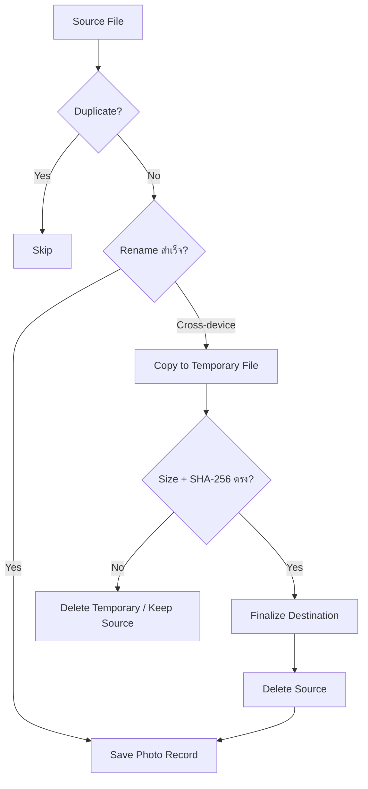

# Backup Engine

กลับไปที่ [[00-Backend Architecture]]

## Scan Flow

1. ตรวจว่า Source มีอยู่จริง
2. อ่านรายการไฟล์
3. ข้าม Directory และไฟล์ที่ไม่รองรับ
4. ตรวจ Extension
5. อ่าน File Header เพื่อตรวจประเภทจริง
6. ส่งรายการรูปให้ Frontend

Backend ต้องตรวจประเภทไฟล์อีกครั้งก่อน Move แม้ Frontend จะส่ง Path มาแล้ว

## Move Flow

### Same Drive

1. ตรวจ Source/Destination
2. ตรวจ Duplicate ใน Disk และ Database
3. Rename/Move
4. ตรวจไฟล์ปลายทาง
5. บันทึก Database

### Cross Drive

1. ตรวจ Duplicate
2. Copy ไปชื่อชั่วคราว
3. Flush และ Close
4. เปรียบเทียบ Size และ SHA-256
5. Rename ไฟล์ชั่วคราวเป็นชื่อจริง
6. ลบ Source เมื่อ Verify ผ่าน
7. บันทึก Database

## Safety Rules

- ห้ามลบ Source ก่อน Destination ผ่าน Verify
- ถ้า Duplicate ให้เก็บ Source
- ถ้า DB บันทึกล้มเหลว ให้รายงานสถานะเพื่อ Reconcile
- ลบ Temporary File เมื่อ Copy ล้มเหลว
- ใช้ Worker Pool แทนการสร้าง Goroutine ไม่จำกัด
- Validate ว่า Selected Path อยู่ใต้ Source จริง

## Integrity Check

- Query `photos` ตาม Destination
- ตรวจ `dest + filename`
- พบไฟล์ → `active`
- ไม่พบไฟล์ → `missing`
- ลบจากภายนอกแอป → `missing`
- ลบผ่านแอป → ลบไฟล์จริง แล้วลบ `photos` และ `photo_tags` ใน Transaction
- หากลบไฟล์จริงสำเร็จแต่ลบ Database ล้มเหลว ให้ Integrity Check ตรวจเป็น `missing` และ Retry การลบ Database ได้

## Result Summary

- Requested
- Success
- Skipped
- Failed
- Total Duration
- Error รายไฟล์
