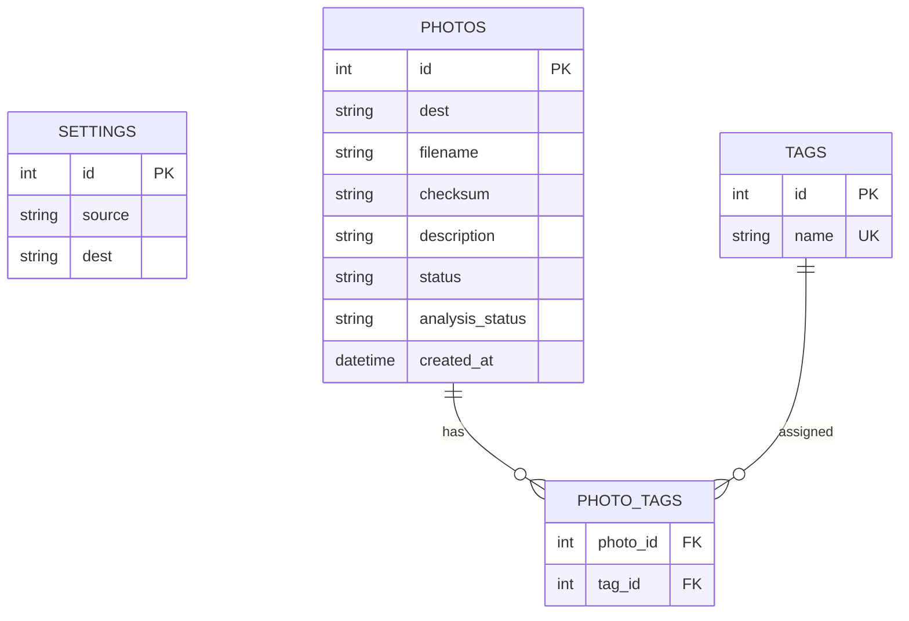

# Database and GORM

กลับไปที่ [[00-Backend Architecture]]

## ตารางหลัก 4 ตาราง

### `settings`

| Field | Purpose |
|---|---|
| `id` | Primary Key |
| `source` | Source ล่าสุด |
| `dest` | Destination ล่าสุด |

ใช้ Record เดียวและ Update ค่าเดิม

### `photos`

| Field | Purpose |
|---|---|
| `id` | Primary Key |
| `dest` | Destination |
| `filename` | ชื่อไฟล์ |
| `checksum` | SHA-256 |
| `description` | AI Description |
| `status` | `active`, `missing` |
| `analysis_status` | `pending`, `processing`, `completed`, `failed` |
| `created_at` | เวลาที่ย้ายสำเร็จ |

Constraints:

- Unique: `dest + filename`
- Index: `dest`
- Index: `dest + checksum`
- Index: `analysis_status`

### `tags`

| Field | Purpose |
|---|---|
| `id` | Primary Key |
| `name` | Tag ที่ไม่ซ้ำ |

### `photo_tags`

| Field | Purpose |
|---|---|
| `photo_id` | Foreign Key → `photos` |
| `tag_id` | Foreign Key → `tags` |

ใช้ `photo_id + tag_id` เป็น Composite Primary Key หรือ Unique Constraint

## ER Diagram

## Transaction Rules

- สร้าง Photo หลัง Move และ Verify สำเร็จ
- Insert Tag ที่ยังไม่มี
- เชื่อม `photo_tags` โดยไม่สร้างคู่ซ้ำ
- Description และ Tags ควรบันทึกใน Transaction เดียว
- Query ประวัติต้อง Filter ด้วย Destination
- เมื่อลบผ่านแอป ให้ลบไฟล์จริงและลบ `photos`; ตั้ง Foreign Key Cascade เพื่อลบ `photo_tags` ตาม
- ห้ามลบ `tags` ที่ยังมีรูปอื่นใช้งานอยู่

## Optional Table

เพิ่ม `transfer_jobs` ภายหลังหากต้องเก็บประวัติการกด Move และเวลารวมทุกครั้ง ไม่จำเป็นต่อ MVP
