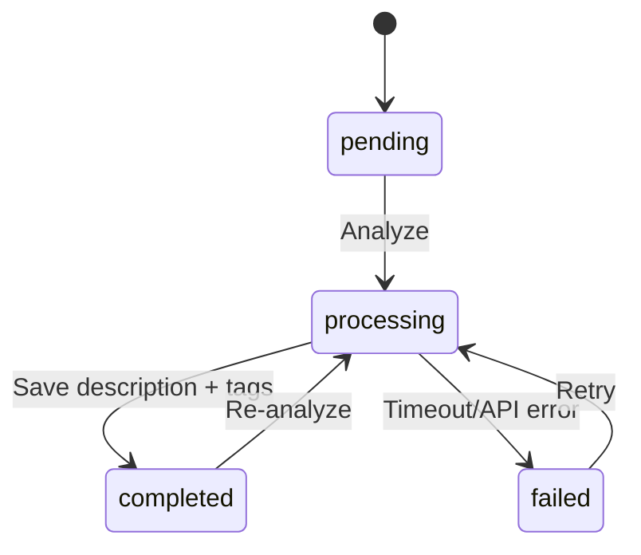

# AI and Search

กลับไปที่ [[00-Backend Architecture]]

## Analysis Flow



## Rules

- อ่านรูปจาก Destination เท่านั้น
- AI ไม่ต้องเข้าถึง Source
- AI ล้มเหลวต้องไม่ลบหรือย้อน Move
- เก็บผลใน Database เพื่อไม่วิเคราะห์ซ้ำ
- API response ต้องถูก Validate ก่อนบันทึก
- จำกัด Timeout และจำนวน Retry
- API Key ห้ามอยู่ใน Source Code หรือ Git

## Expected Result

```text
Description: แมวสีส้มนั่งอยู่บนโซฟา
Tags: cat, orange, sofa, indoor
```

ไม่จำเป็นต้องเก็บค่า Confidence ใน MVP

## Search

### Description Search

- รับข้อความจากผู้ใช้
- ค้นแบบบางส่วน
- ไม่สนตัวพิมพ์เล็ก/ใหญ่สำหรับภาษาอังกฤษ
- Filter ตาม Destination และ Status

### Tag Search

- Join `photos`, `photo_tags`, `tags`
- เลือกหนึ่งหรือหลาย Tags
- ค้นเฉพาะ Photo สถานะ `active`

### Tag Cloud

- Group ตาม Tag
- Count จำนวน Photos
- ขนาด Tag ใน UI อิงจำนวนที่พบ
- Filter ตาม Destination ปัจจุบัน

## Failure Cases

- ไม่มี Internet
- API Key ไม่ถูกต้อง
- Rate Limit
- Unsupported Image
- Response ไม่เป็นรูปแบบที่กำหนด
- Database Save ล้มเหลว

ทุกกรณีต้องเปลี่ยนสถานะเป็น `failed`, เก็บข้อความ Error ที่เหมาะสม และ Retry ได้
